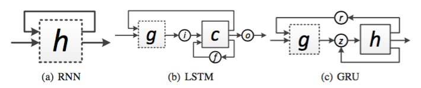

# Summary
* Apply dropout on recurrent connection of RNN directly, different conventional dropout on feed-forward connections.
* Propose dropout mask for RNN in order to avoid hidden state dropped on every step.
* Propose dropout on hidden states updates for GRU and LSTM.

Illustration of the three types of recurrent networks used in the paper. Arrows, squares and circles represent connections, hidden states and gates respectively. Dashed squares illustrate places where we apply dropout.